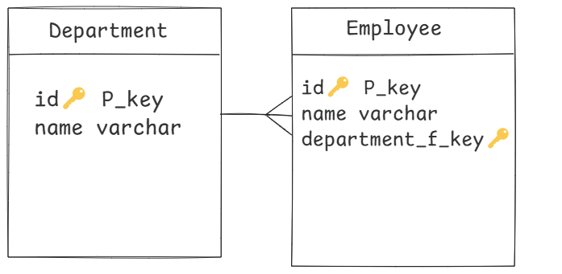

#  Acme Human Resources (HR) 
###  build an API that the Acme Human Resources (HR) Department can use to manage its employees and departments. A department can have many employees, and an employee must belong to a department.




### Setting up .env for the Project
- npm install dotenv
- create a .env file
- Create a .env file in the root directory of the project <br> 
  replacing the values with your own PostgreSQL environment details: 
- require('dotenv').config({ path: `${__dirname}/your_path ` });

```
PGUSER=your_postgres_username      # Replace with your PostgreSQL username
PGHOST=localhost                   # Leave as localhost unless your database is hosted elsewhere
PGDATABASE=your_database_name      # Replace with the name of your PostgreSQL database
PGPASSWORD=your_password           # Replace with your PostgreSQL password
PGPORT=5432                        # Default PostgreSQL port (use 5432 unless it's different)
```

