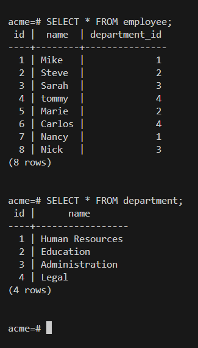

#  Acme Human Resources (HR) 
###  build an API that the Acme Human Resources (HR) Department can use to manage its employees and departments. A department can have many employees, and an employee must belong to a department.


## Installation

1. Clone the repository:
    ```bash
    git clone https://github.com/mastering23/acme_hr_directory.git
    ```

- npm install pg
  ```bash
    $ npm install pg
    ```
    node-postgres (PG)  is a collection of node.js modules for interfacing with your PostgreSQL database.
 
npm install express
```bash
   $ npm install express
  ```


### Setting up .env for the Project
I'm using npm dotenv to keep my environment details private,
while allowing others to use their own environment settings.

- npm install dotenv
  ```bash
    npm install dotenv
    ```
- create a .env file
- Create a .env file in the root directory of the project <br> 
Here is an example :  
 <br>
  client.cjs setting up : 
  replacing the values with your own PostgreSQL environment details: <br>
  path location base on your files.
- require('dotenv').config({ path: `${__dirname}/your_path ` });
  

```
PGUSER=your_postgres_username      # Replace with your PostgreSQL username
PGHOST=localhost                   # Leave as localhost unless your database is hosted elsewhere
PGDATABASE=your_database_name      # Replace with the name of your PostgreSQL database
PGPASSWORD=your_password           # Replace with your PostgreSQL password
PGPORT=5432                        # Default PostgreSQL port (use 5432 unless it's different)
```


- Add inside of your .gitignore  .env/ <br>


### Set up the PostgreSQL database:
    - Create a PostgreSQL database.
    - Update the database configuration in `config.js`.

 
 
 
 ### server.cjs:
  
  ```bash
  $ node server.cjs
  ```
## API Endpoints

### Employees
- `GET /api/employees`: Get all employees.
- `POST /api/employees`: Add a new employee (name, email).
- `PUT /api/employees/:id`: Update an employee by ID.
- `DELETE /api/employees/:id`: Delete an employee by ID.

### Departments
- `GET /api/departments`: Get all departments.
- `POST /api/departments`: Add a new department (name).
- `PUT /api/departments/:id`: Update a department by ID.
- `DELETE /api/departments/:id`: Delete a department by ID.

<br>

  # Result example 
  
  
  